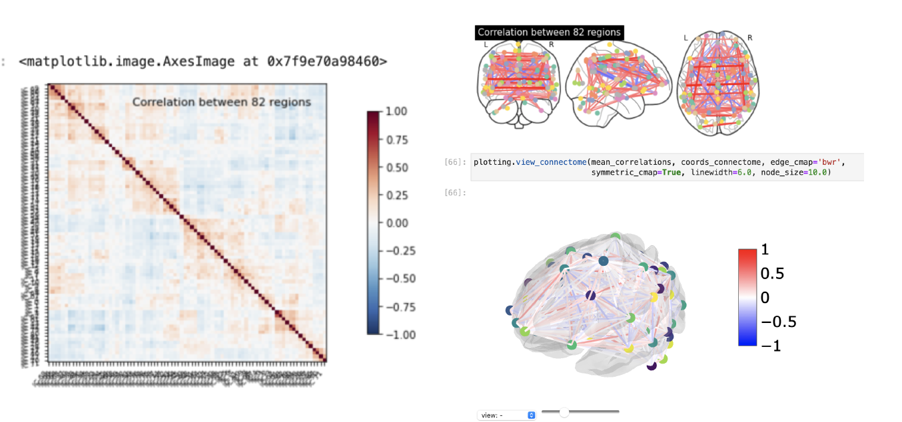

# Identifying ADHD Brain Network

In our analysis we leveraged the Nipye and Nilearnpython libraries to generate network graphs from MRI scans. We were able to generate correlationmatrices of the MRI scans by extracting a timeseries from the scans metadata. The Nodes were generated in a bimodal fashion using a brain atlasin conjunction with the active regions of the scans.These nodes with the supporting time seriesallowed us to measure the connectivity between the nodes using the ConnectivityMeasurefunctions. After generating an adjacency matrix for each scan we ran an averaged correlationacross all ten scans to generate the final matrix used to plot our network graph. 82 Nodes weregenerated with their local activity and correlations between nodes being plotted as the connectingedges.

